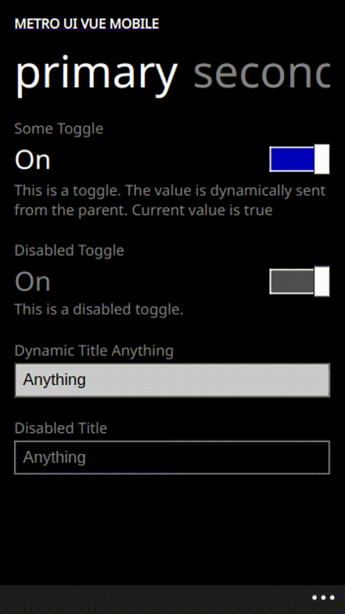
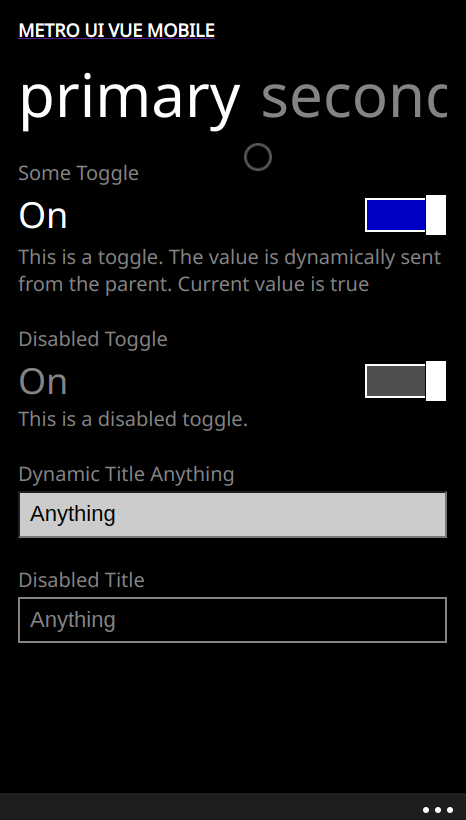
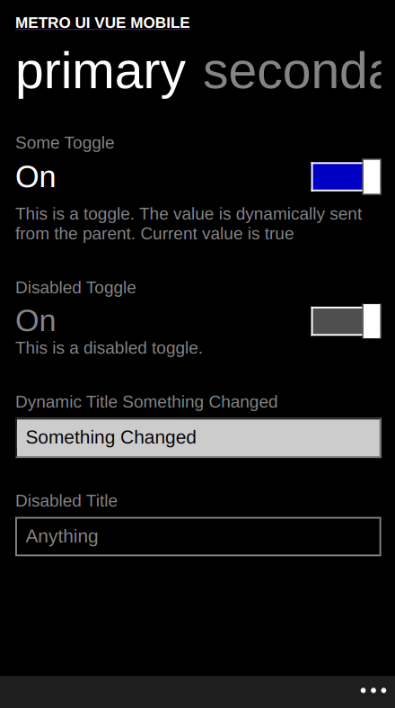

# metro-ui-vue-mobile

This project aims to create a mobile first vue project that uses metro-ui based components. It has all the basic features of a vue project enabled as it is a direct clone of vue@latest modified to include the necessary components.

This template should help get you started developing with Vue 3 in Vite.

## Figma Designs

The design UI layouts as well as a dump of some templates can be found at the [Figma Sheets](https://www.figma.com/file/7E6FciiywMm9jw7dmP4TaO/Metro-UI-Vue-Mobile?type=design&mode=design&t=EnKAyCobealGafJP-1)

## Recommended IDE Setup

[VSCode](https://code.visualstudio.com/) + [Volar](https://marketplace.visualstudio.com/items?itemName=Vue.volar) (and disable Vetur) + [TypeScript Vue Plugin (Volar)](https://marketplace.visualstudio.com/items?itemName=Vue.vscode-typescript-vue-plugin).

## Type Support for `.vue` Imports in TS

TypeScript cannot handle type information for `.vue` imports by default, so we replace the `tsc` CLI with `vue-tsc` for type checking. In editors, we need [TypeScript Vue Plugin (Volar)](https://marketplace.visualstudio.com/items?itemName=Vue.vscode-typescript-vue-plugin) to make the TypeScript language service aware of `.vue` types.

If the standalone TypeScript plugin doesn't feel fast enough to you, Volar has also implemented a [Take Over Mode](https://github.com/johnsoncodehk/volar/discussions/471#discussioncomment-1361669) that is more performant. You can enable it by the following steps:

1. Disable the built-in TypeScript Extension
   1) Run `Extensions: Show Built-in Extensions` from VSCode's command palette
   2) Find `TypeScript and JavaScript Language Features`, right click and select `Disable (Workspace)`
2. Reload the VSCode window by running `Developer: Reload Window` from the command palette.

## Customize configuration

See [Vite Configuration Reference](https://vitejs.dev/config/).

## Project Setup

```sh
npm install
```

### Compile and Hot-Reload for Development

```sh
npm run dev
```

### Type-Check, Compile and Minify for Production

```sh
npm run build
```

### Run Unit Tests with [Vitest](https://vitest.dev/)

```sh
npm run test:unit
```

### Lint with [ESLint](https://eslint.org/)

```sh
npm run lint
```

## Components

The system creates several new components. That simulates the metro UI effectively. The following components are included:

### Appbar

The appbar is a component that has app page specific controls. It is a fixed component that is always visible on the bottom of the screen. It is usually circular buttons and can be toggled by tapping on the three dots.


The appbar can accept a list of Objects as its props. Each object should have the following properties:

```ts
{
    "iconButtons"?: [
        {
            "title": "String",
            "route": "String",
        }
    ]
}
```

An invocation will be of the form:

```html
    <AppBar :iconButtons="[{title: 'fa-solid fa-info', route: '/about'}]"/>
```

### App Title

The app title is a component that displays the title of the app. It is a fixed component that is always visible on the top of the screen. It is usually the name of the app.


The apptitle can accept a string as its props. The string is the title of the app.

```ts
{
   "text"!: "String",
}
```

An invocation will be of the form:

```html
    <AppTitle text="Metro UI Vue Mobile"/>
```

### Page View [UNANIMATED]

This is a container component that is used to display the content of the page. It is a scrollable component that is always visible on the screen. It is usually the content of the page. It can accept any component as its props. The page view component can have multiple page titles and page contents. Everything will be rendered in one dom over multiple `100vw`s. Thus, the page view component is scrollable but snaps to the next page when scrolled.

There is a piece of code inside the pageViews that will allow it to switch between pages when the user swipes. Credits: [Rob](https://stackoverflow.com/users/635733/rob)

```js
   let touchEvent:any = null
    document.addEventListener('touchstart', (event: any) => {
        touchEvent = new TouchEvent(event)
    })
    const handleSwipe = (event: any) => {
        if (!touchEvent) {
            return
        }
        touchEvent.setEndEvent(event);
        if (touchEvent.isSwipeLeft()) {
            // viewPointer = (viewPointer + 1) % views.length 
            if (viewPointer + 1 > views.length - 1) {
            } else {
                viewPointer = viewPointer + 1
                scrollToView(views[viewPointer])
            }
        } else if (touchEvent.isSwipeRight()) {
            // viewPointer = viewPointer - 1 < 0 ? views.length - 1 : viewPointer - 1
            if(viewPointer - 1 < 0) {
            } else {
                viewPointer = viewPointer - 1
                scrollToView(views[viewPointer])
            }
        }
    }
    document.addEventListener('touchend', handleSwipe);
```

To capture simple gestures, this setup can be reused. I will try to make it into an event or something more efficient in the future.

The Page View works in conjuction with a page-title and page-content list. This components handles the rendering and the gesture navigation between pages.

This is a named-slotted component where the slot names must match with those provided in the pages prop, both in count and value.



The following props are available for the page view:

```ts
{
   "tabs"!: [
         {
              "text": "String",
              "id": "String"
         }
    ],
    "pages"!: [
        "String"
    ]
}
```

An invocation will be of the form:

```html
    <PageView 
      :tabs="[
        {
          text: 'Primary',
          id: 'home-primary'
        },
        {
          text: 'Secondary',
          id: 'home-secondary'
        },
        {
          text: 'Tertiary',
          id: 'home-tertiary'
        }
      ]"
      :pages="[
        'page-one',
        'page-two',
        'page-three'
      ]"
    >
        <template v-slot:page-one>
            <Toggle title="Some Toggle" :description="`This is a toggle. The value is dynamically sent from the parent. Current value is ${toggleValue}`" :assignedValue="true" v-model="toggleValue"/>
            <Toggle title="Disabled Toggle" :description="`This is a disabled toggle.`" :assignedValue="true" :disabled="true"/>
            <TextBox :title="`Dynamic Title ${textboxValue}`" :initialValue="initialTextValue" v-model="textboxValue"/>
            <TextBox title="Disabled Title" :initialValue="initialTextValue" :disabled="true"/>
        </template>
        <template v-slot:page-two>
          <TextBox :title="`Dynamic Title in Page Two ${textboxPageTwoValue}`" :initialValue="initialTextValue" v-model="textboxPageTwoValue"/>  
        </template>
        <template v-slot:page-three>
        </template>
    </PageView>
```

### Page Content

This is a component that is used to display the content of the page. It is a slotted component that renders the current page content. The page content can accept any component as its props. Multiple Page Contents will be served using a Page View which will take care of gesture navigation between pages.



An invocation will be of the form:

```html
    <PageContent>
        <div>
            <span>Page 1</span>
        </div>
    </PageContent>
```

### Page Title

This is a component that is used to display the title of the page. It is a fixed component that is always visible on the top of the screen. It is usually the title of the page. It can accept a string as its props. It is nested inside the page view component. There can be multiple page titles in a page view.


Each page title has the following properties:

```ts
{
   "text"!: "String",
}
```

An invocation will be of the form:

```html
    <PageTitle text="Page 1"/>
```

### Toggle [UNANIMATED]

This is a component that is used to display a toggle. It is populated as a part of the pageview. It may be disabled on user choice.


The toggle has the following properties:

```ts
{
   "title"!: "String",
   "description"!: "String",
   "assignedValue"?: "Boolean",
   "disabled"?: "Boolean"
}
```

This is a component that returns a value. The value can be read using `v-model`.

An invocation will be of the form:

```html
    <Toggle title="Toggle" description="This is a toggle" v-model="toggleValue"/>
    <Toggle title="Toggle" description="This is a disabled toggle" v-model="toggleValue" disabled/>
```

### TextBox

This is the component that handles the basic text input in the framework. It can have a disabled display-only mode like the toggle.



The TextBox has the following properties:

```ts
{
   "title"!: "String",
   "initialValue"?: "Boolean",
   "disabled"?: "Boolean"
}
```

This is a component that returns a value. The value can be read using `v-model`.

An invocation will be of the form:

```html
    <TextBox title="TextBox" v-model="textBoxValue"/>
    <TextBox title="TextBox" v-model="textBoxValue" disabled/>
    <TextBox title="TextBox" v-model="textBoxValue" initialValue="Initial Value"/>
```

##### license

The toolkit is licensed under the GNU GPL v3.0 license. You can find the license in the LICENSE file in the root directory of the project.

##### Contributing

You can contribute to the project by creating a pull request. Please make sure that you have read the contributing guidelines before creating a pull request.

##### Issues

You can create an issue in the issues tab. Please make sure that you have read the issue guidelines before creating an issue.

##### Contact

You can contact me at [my email](mailto:samarmusthafa2014@gmail.com).

##### Credits

- god-s-perfect-idiot
